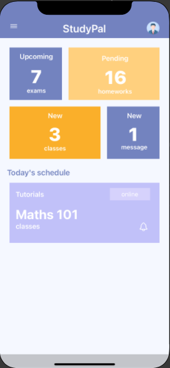
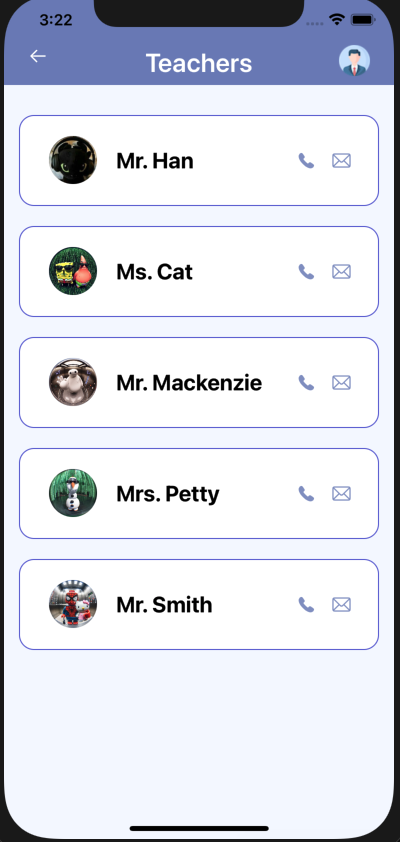

# StudyPal – iOS Student Study App

## Introduction  
StudyPal is a modern and well-structured **iOS Student Study App** built using **Swift**, **UIKit**, and **Storyboards**, focused on helping students manage their academic activities efficiently in one place.  

This project demonstrates a **real-world iOS app structure** with multiple modules such as **Onboarding**, **Home Dashboard**, **Classes**, **Homework**, **Exams**, **Teachers**, and **Messages**, all connected through clean navigation flows.

---

## Screens Included  
- **Onboarding Screen**: Introductory screen before entering the app  
- **Home Screen**: Dashboard showing today’s schedule and overview  
- **Menu Screen**: Central navigation hub  
- **Classes Screen**: Displays enrolled classes using card-based UI  
- **Class Detail Screen**: Shows detailed information of a selected class  
- **Homework Screen**: Subject-wise homework tracking  
- **Exams Screen**: Upcoming exams with sign-up options  
- **Teachers Screen**: Teacher list with profile images  
- **Messages Screen**: Chat-style conversation list  

---

## Features  

### Onboarding Screen  
- Acts as the entry point of the application  
- Introduces the purpose of the app  
- Smooth transition to the Home Screen using `UINavigationController`  

---

### Home Screen  
- Displays **Today’s Schedule** using `UICollectionView`  
- Provides quick academic insights such as:
  - Upcoming exams  
  - Pending homework  
  - Classes  
  - Messages  
- Supports both **portrait and landscape** orientations  
- Clean and minimal dashboard layout  

---

### Menu Screen  
- Serves as the central navigation hub  
- Provides access to:
  - Classes  
  - Homework  
  - Exams  
  - Teachers  
  - Grades  
  - Messages  
- Consistent UI design across all menu items  

---

### Classes Screen  
- Displays all enrolled classes using card-style collection view cells  
- Each card shows class title and details  
- Tapping a class navigates to the **Class Detail Screen**  
- Reusable and modular cell design  

---

### Class Detail Screen  
- Displays detailed information about a selected class  
- Includes:
  - Background illustration  
  - Lecturer details  
  - Class description  
- Focused on clarity and visual hierarchy  

---

### Homework Screen  
- Subject-wise homework list  
- Checkbox-style UI for task completion  
- Simple and intuitive task tracking experience  

---

### Exams Screen  
- Exam cards displaying:
  - Subject name  
  - Exam date  
  - Exam mode (Online / Offline)  
- Includes **Sign Up** option for exams  
- Modular structure using models and custom cells  

---

### Teachers Screen  
- Displays list of teachers with profile images  
- Includes contact action icons  
- Clean and readable list-based layout  

---

### Messages Screen  
- Chat-style conversation list  
- Displays recent conversations  
- Prepared for future real-time messaging integration  

---

### Navigation  
- **UINavigationController** for screen transitions  
- **Storyboard Segues** for navigation flow  
- Predictable and smooth back navigation behavior  

---

## Project Structure  

```text
StudyPal
│
├── App
│   ├── AppDelegate.swift
│   ├── SceneDelegate.swift
│   └── Info.plist
│
├── Resources
│   ├── Main.storyboard
│   ├── LaunchScreen.storyboard
│   └── Assets.xcassets
│
├── Models
│   ├── ScheduleItem.swift
│   ├── ClassItem.swift
│   └── ExamItem.swift
│
├── Controllers
│
│   ├── Onboarding
│   │   └── OnboardingViewController.swift
│
│   ├── Home
│   │   └── HomeViewController.swift
│
│   ├── Menu
│   │   └── MenuViewController.swift
│
│   ├── Classes
│   │   ├── ClassesViewController.swift
│   │   └── Maths101ViewController.swift
│
│   ├── Homework
│   │   └── HomeworkViewController.swift
│
│   ├── Exams
│   │   └── ExamsViewController.swift
│
│   ├── Teachers
│   │   └── TeachersViewController.swift
│
│   └── Messages
│       └── MessagesViewController.swift
│
├── Views
│   └── Cells
│       ├── ScheduleCardCell.swift
│       ├── ClassCardCell.swift
│       └── ExamCardCell.swift

```
## Prerequisites  
- Xcode 12.0 or later  
- iOS 14.0 or later   

---

## License  
This project is created for **learning and portfolio purposes**.

---

## Contributing  
Contributions are welcome.  
If you find any issues or have suggestions for improvement, please submit an issue or create a pull request.

---

## Support  
If you encounter any problems or have questions, please contact the project maintainer.

---

## Acknowledgements  
Thanks to the **Apple Developer Community** for their frameworks and documentation,  
which greatly facilitated the development of this project.

---

## Screenshots  

<div style="display: flex; flex-wrap: wrap; gap: 10px;">
  
  
  
  
  
  
  
  
  
</div>

---

## Demo Video  

[🎬 Watch Full Demo on ScreenPal](https://go.screenpal.com/watch/cTlZ1QnYN6S)


