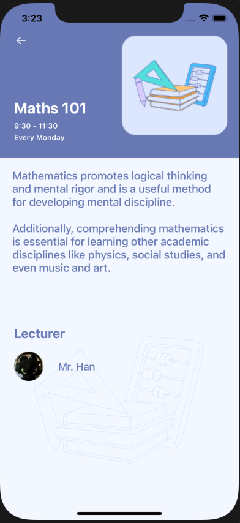

# 📘 StudyPal – iOS Student Study App

StudyPal is an iOS application built using **UIKit and Storyboards** that helps students manage their academic activities such as classes, homework, exams, teachers, and messages in one place.

This project focuses on **clean UI, modular code structure, and real-world app navigation**.

---

## 📱 App Screens

| Onboarding | Home | Menu |
|-----------|------|------|
|  |  |  |

| Classes | Homework | Exams |
|--------|----------|-------|
|  |  |  |

| Teachers | Messages | Class Detail |
|----------|----------|--------------|
|  |  |  |

Each screen is connected using a **UINavigationController** and **Storyboard segues**.

---

## 🗂️ Project Structure

The project is organized in a **feature-based structure** for better readability and scalability.

```text
palStudy
│
├── Maths101ViewController
│   └── Maths101ViewController.swift
│
├── MessagesViewController
│   └── MessagesViewController.swift
│
├── TeachersViewController
│   └── TeachersViewController.swift
│
├── ExamsViewController
│   ├── model
│   │   └── ExamItem.swift
│   ├── cells
│   │   └── ExamCardCell.swift
│   └── ExamsViewController.swift
│
├── HomeworkViewController
│   └── HomeworkViewController.swift
│
├── ClassesViewController
│   ├── cells
│   │   └── ClassCardCell.swift
│   ├── models
│   │   └── ClassItem.swift
│   └── ClassesViewController.swift
│
├── HomeViewController
│   ├── cells
│   │   └── ScheduleCardCell.swift
│   ├── models
│   │   └── ScheduleItem.swift
│   └── HomeViewController.swift
│
├── OnboardingViewController
│   └── OnboardingViewController.swift
│
├── MenuViewController
│   └── MenuViewController.swift
│
├── AppDelegate.swift
├── SceneDelegate.swift
├── Main.storyboard
├── LaunchScreen.storyboard
├── Info.plist
└── Assets.xcassets
```

---

## ✨ Features

### 🏠 Home
- Dashboard with upcoming exams, pending homework, new classes, and messages
- “Today’s Schedule” implemented using `UICollectionView`

### 📚 Classes
- Class list displayed using collection view cards
- Tapping a class navigates to the class detail screen

### 📖 Class Detail
- Detailed information about a class
- Background illustration and lecturer information

### 📝 Homework
- Subject-wise homework list
- Checkbox-style task completion UI

### 🧪 Exams
- Exam cards with subject, date, mode, and sign-up button
- Option to sign up for another exam

### 👩‍🏫 Teachers
- Teacher list with profile images and contact icons

### 💬 Messages
- Chat-style message list with recent conversations

---

## 🛠️ Tech Stack

- **Language:** Swift
- **Framework:** UIKit
- **UI Design:** Storyboards & Auto Layout
- **Architecture:** MVC
- **Navigation:** UINavigationController + Segues
- **iOS Version:** iOS 14+

---

## 🎯 Learning Goals

This project was built to practice:

- UIKit & Storyboard-based UI development
- UICollectionView & UITableView usage
- Modular file organization
- Navigation and screen flow
- Auto Layout & adaptive layouts
- Real-world app structure

---

## 🚧 Future Improvements

- Firebase Authentication (Login / Sign Up)
- Google Sign-In integration
- Data persistence
- Backend integration
- Push notifications

---

## 👨‍💻 Author

**Jai Srivastava**  
iOS Developer (Learning & Building)

---

## 📄 License

This project is created for **learning and portfolio purposes**.

	
